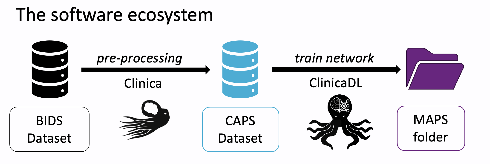

ClinicaDL is the deep learning extension of [Clinica](https://aramislab.paris.inria.fr/clinica/docs/public/latest/WhatIsClinica/),
an open source python library for neuroimaging preprocessing.



## Data formatting

Clinica (and so ClinicaDL) relies on raw input data sets formatted with the [BIDS (Brain Imaging Data Structure)
standard](https://aramislab.paris.inria.fr/clinica/docs/public/latest/BIDS/).
This standard is largely used in the neuroimaging community, and many data sets are available in this format,
or tools were developed to convert them to BIDS.

Clinica preprocesses the images in BIDS format and outputs a [CAPS (ClinicA Processed
Structure)](https://aramislab.paris.inria.fr/clinica/docs/public/latest/CAPS/Introduction/)
folder in which preprocessed images are stored. The CAPS format can be seen as an extension of
the BIDS.

Finally, ClinicaDL takes as input these preprocessed images to train deep neural networks.
To guarantee reproducibility, the training procedure outputs multiple files which are organized
according to a specific structure: the **MAPS** (Model Analysis and Processing Structure).

## MAPS definition

A MAPS folder contains all the elements obtained during the training and other post-processing procedures
applied to a particular deep learning framework. The hierarchy is organized according to the **fold**,
**selection metric** and **data group** used.

1. **fold**: In ClinicaDL, a training procedure consists in training one model per train / validation split defined by the validation
procedure. Then the MAPS contains `N` folders named `split-<i>` with i between 0 and N-1 containing the best networks obtained
for the `i`-th train / validation split.
2. **selection metric**: for each fold, one network is selected per `selection_metrics` asked by the user (see [Implementation Details](Train/Details.md#model-selection)
for more information). The output folder containing all information linked to a network selected according to a metric `metric` is named
`best-<metric>`.
3. **data group**: Finally, network depending on a fold and a selection metric can be applied to any data group to [compute individual results and metrics](./Predict.md) and [interpretability maps](./Interpret.md).
These data groups are defined at the root of the MAPS to ensure that their characteristics are shared across all the models.

!!! note "train and validation groups"
    `train` and `validation` data groups are automatically created during the training procedure.
    These groups can not be changed (overwritten) by the user.
    Moreover data of this group is fold dependent, then it can only be loaded and used if a fold number
    is specified (contrary to other groups).

!!! warning "prevention of data leakage"
    The ensemble of all data seen by the network during the training procedure (train + validation data)
    is summarized in `groups/train+validation.tsv` file.
    If transfer learning was used, this file also comprises the participants and sessions seen during pretraining.
    **To prevent data leakage, ClinicaDL prevents the user from creating a data group having a participant ID intersection
    with this training data.**

An example of a MAPS structure is given below:

```Text
<maps_directory>
├── environment.txt
├── split-0
│       ├── best-loss
│       │       ├── model.pth.tar
│       │       ├── train
│       │       │       ├── description.log
│       │       │       ├── train_image_level_metrics.tsv
│       │       │       └── train_image_level_prediction.tsv
│       │       └── validation
│       │               ├── description.log
│       │               ├── validation_image_level_metrics.tsv
│       │               └── validation_image_level_prediction.tsv
│       └── training_logs
│               ├── tensorboard
│               │       ├── train
│               │       └── validation
│               └── training.tsv
├── groups
│       ├── train
│       │       ├── split-0
│       │       │       ├── data.tsv
│       │       │       └── maps.json
│       │       └── split-1
│       │               ├── data.tsv
│       │               └── maps.json
│       ├── train+validation.tsv
│       └── validation
│               ├── split-0
│               │       ├── data.tsv
│               │       └── maps.json
│               └── split-1
│                       ├── data.tsv
│                       └── maps.json
└── maps.json
```

The different levels of the MAPS hierarchy are described in the following sections.

### Level 1 - validation procedure & groups

The first level of the MAPS hierarchy contains the following files:

```Text
<maps_directory>
├── environment.txt
├── split-0
├── ...
├── split-<N-1>
├── groups
└── maps.json
```

- `environment.txt` contains the description of the environment used for the experiment (output of `pip freeze`).
- `maps.json` is the global configuration file of the MAPS which contains all the information to reproduce the training procedure.
- `split-<i>` is a folder containing the result of the training on the `i`-th split of validation procedure. All possible folds
may not be present if the user chose to train only a subset of folds.
- `groups` is a folder in which all the data groups used by the MAPS are defined. This folder has the following file system:
    ```Text
    groups
    ├── train+validation.tsv
    ├── train
    │       ├── split-0
    │       │       ├── data.tsv
    │       │       └── maps.json
    │       ├── ...
    │       └── split-<N-1>
    │               ├── data.tsv
    │               └── maps.json
    ├── validation
    │       ├── split-0
    │       │       ├── data.tsv
    │       │       └── maps.json
    │       ├── ...
    │       └── split-<N-1>
    │               ├── data.tsv
    │               └── maps.json
    └── <data_group>
            ├── data.tsv
            └── maps.json
    ```
    - `train+validation.tsv` file contains all the participant and session IDs used during training (and pretraining if applicable).
    - `train` and `validation` data groups contains one folder per fold in the validation procedure. Then each fold contains the same
    files than `<data_group>`.
    - `<data_group>` contains two files: `data.tsv` containing the list of participant_IDs, session_IDs and the label (if applicable), and
    `maps.json` the configuration file of the group which contains the path to the CAPS directory and a boolean value defining if the group
    is using a [multi-cohort setting](./Train/Details.md#multi-cohort).

### Level 2 - metrics of selection & training logs

The second level corresponds to the content of folder `split-<i>`. It contains the best models selected during training according to the validation
performance according to a metric `metric`. It also contains the evolution of all evaluation metrics computed on the training
 and validation sets in two different formats:
- `tensorboard` is a folder containing logs that can be visualized with the command `tensorboard --logdir <maps_directory>/split-<i>/training_logs/tensorboard`,
- `training.tsv` is a TSV file.

```Text
split-<i>
    ├── best-<metric>
    └── training_logs
           ├── tensorboard
           │       ├── train
           │       └── validation
           └── training.tsv
```

### Level 3 - model application to data groups

The last level corresponds to the content of `best-<metric>`. In this folder, the weights of the model is available (`best_model.pth.tar`)
and their application to different data groups can be found:

```Text
best-<metric>
    ├── model.pth.tar
    ├── train
    ├── validation
    └── <data_group>
```

`train` and `validation` data groups are automatically created as their predictions are computed during the training procedure.
Other groups may exist if [predictions](./Predict.md) and [interpretations](./Interpret.md) were computed.
The content of the data group folders depend on the operations performed, then for more information please refer to the corresponding sections.
