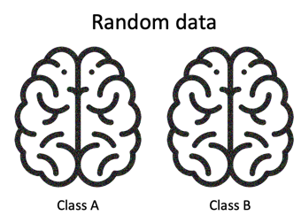
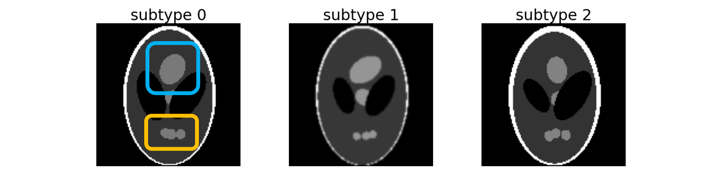

# `generate` - Generate synthetic data sets

This command generates three types of synthetic data sets for a binary classification 
depending on the option chosen: `trivial`, `random` or `shepplogan`.

## `trivial` - Separable 3D images 

This command generates a synthetic dataset for a binary classification task from a CAPS-formatted dataset. 
It produces a new CAPS containing trivial data which should be perfectly classified by a classifier. 
Each label corresponds to brain images whose intensities of  respectively the right or left hemisphere 
are strongly decreased.

Trivial data are useful for debugging a framework: hyper parameters can be more easily tested as 
fewer data samples are required and convergence should be reached faster as the classification task is simpler.


### Prerequisites
You need to execute the `clinica run` and `clinicadl extract` pipelines prior to running this task.

!!! note
    The `trivial` option can synthesize at most a number of images per label that is equal to the total number of images 
    in the input CAPS.

### Running the task

The task can be run with the following command line:
```
clinicadl generate trivial [OPTIONS] CAPS_DIRECTORY GENERATED_CAPS_DIRECTORY
```
where:

- `CAPS_DIRECTORY` (str) is the input folder containing the neuroimaging data in a [CAPS](https://aramislab.paris.inria.fr/clinica/docs/public/latest/CAPS/Introduction/) hierarchy.
- `GENERATED_CAPS_DIRECTORY` (str) is the folder where the synthetic CAPS is stored.

Options:

- `--participants_tsv` (str) is the path to a tsv file containing the subjects/sessions list for data generation.
- `--n_subjects` (int) number of subjects per label in the synthetic dataset. Default: `300`.
- `--preprocessing` (str) preprocessing pipeline used in the input `caps_directory`. Default: `t1-linear`.
- `--mask_path` (str) Path to the atrophy masks used to generate the two labels. 
Default will download masks based on AAL2 in `clinicadl/resources/masks`.
- `--atrophy_percent` (float) Percentage of intensity decrease applied to the regions targeted by the masks. Default: 60.

### Outputs

The command generates 3D images of same size as the input images formatted as NIfTI files.
Then the [`prepare-data`](./Extract.md) command must be run to use the synthetic data with ClinicaDL.
Results are stored in the same folder hierarchy as the input folder.


## `random` - Indissociable 3D images

This command generates a synthetic dataset for a binary classification task from a CAPS-formatted dataset. 
It produces a new CAPS containing random data which cannot be correctly classified. 
All the images from this dataset comes from the same image to which random noise is added. 
Then the images are randomly distributed between the two labels.



### Prerequisites
You need to execute the `clinica run` and `clinicadl prepare-data` pipelines prior to running this task.

!!! note
    The `random` option can synthesize as many images as wanted with only one input image.

### Running the task

The task can be run with the following command line:
```
clinicadl generate random [OPTIONS] CAPS_DIRECTORY GENERATED_CAPS_DIRECTORY
```
where:

- `CAPS_DIRECTORY` (str) is the input folder containing the neuroimaging data in a [CAPS](https://aramislab.paris.inria.fr/clinica/docs/public/latest/CAPS/Introduction/) hierarchy.
- `GENERATED_CAPS_DIRECTORY` (str) is the folder where the synthetic CAPS is stored.

Options:

- `--participants_tsv` (str) is the path to a tsv file containing the subjects/sessions list for data generation.
- `--n_subjects` (int) number of subjects per label in the synthetic dataset. Default: `300`.
- `--preprocessing` (str) preprocessing pipeline used in the input `caps_directory`. Default: `t1-linear`.
- `--mean` (float) Mean value of the gaussian noise added to images. Default: `0`.
- `--sigma` (float) Standard deviation of the gaussian noise added to images. Default: `0.5`.

### Outputs

The command generates 3D images of same size as the input images formatted as NIfTI files.
Then the [`extract`](./Extract.md) command must be run to use the synthetic data with ClinicaDL.
Results are stored in the same folder hierarchy as the input folder.


## `shepplogan` - 2D slices of heterogeneous classes

This command is named after the [Shepp-Logan phantom](https://en.wikipedia.org/wiki/Shepp%E2%80%93Logan_phantom),
a standard image to test image reconstruction algorithms.

It creates three subtypes of 2D images distributed between two labels. These three subtypes
can be separated according to the Top (framed in blue) and Bottom (framed in orange) regions:
- **subtype 0**: Top and Bottom regions are of maximum size,
- **subtype 1**: Top region has its maximum size but Bottom is atrophied,
- **subtype 2**: Bottom region has its maximum size but Top is atrophied.



These three subtypes are spread between two labels which mimic the binary classification
between Alzheimer's disease patients (AD) with heterogeneous phenotypes and cognitively normal
participants (CN). Default distributions are the following:

subtype |  0   |  1  |  2  |
------- | ---- | --- | --- |
AD      | 5%   | 85% | 10% |
CN      | 100% | 0%  | 0%  |

The CN label is homogeneous, while the AD label is composed of a typical subtype (1), 
an atypical subtype (2) and normal looking images (0).

### Prerequisites

There are no necessary prerequisites to run this pipeline. 

### Running the task

The task can be run with the following command line:
```
clinicadl generate shepplogan [OPTIONS] GENERATED_CAPS_DIRECTORY
```
where `GENERATED_CAPS_DIRECTORY` (str) is the folder where the synthetic CAPS is stored.

Options:

- `--n_subjects` (int) number of subjects per label in the synthetic dataset. Default: `300`.
- `--image_size` (int) is the size in pixels of the squared image. Default:  `128`.
- `--cn_subtypes_distribution` (Tuple[float, float, float]) are the ordered probabilities of each subtype 
  to be drawn in CN label. Default: `(1.0, 0.0, 0.0)`.
- `--ad_subtypes_distribution` (Tuple[float, float, float]) are the ordered probabilities of each subtype 
  to be drawn in CN label. Default: `(0.05, 0.85, 0.10)`.
- `--smoothing` / `--no-smoothing` adds random smoothing to generated data. Default
will not smooth data.


## `hypo-metabolic` - 


### Prerequisites


### Running the task

The task can be run with the following command line:
```
clinicadl generate hypometabolic [OPTIONS] CAPS_DIRECTORY GENERATED_CAPS_DIRECTORY
```
where:
- `CAPS_DIRECTORY` (str) is the input folder containing the neuroimaging data in a [CAPS](https://aramislab.paris.inria.fr/clinica/docs/public/latest/CAPS/Introduction/) hierarchy.
-  `GENERATED_CAPS_DIRECTORY` (str) is the folder where the synthetic CAPS is stored.

Options:

- `pathology`
- `pathology_percent`
- `--participants_tsv` (str) is the path to a tsv file containing the subjects/sessions list for data generation.
- `--n_subjects` (int) number of subjects per label in the synthetic dataset. Default: `300`.


