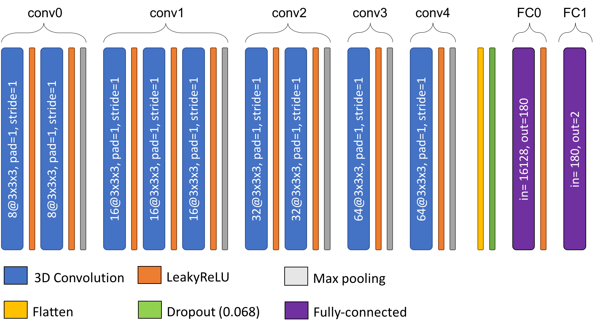

# `random-search`- Hyperparameters exploration

This functionality trains a random model with hyperparameters sampled from a predefined space. 
The hyperparameter space is defined in a `random_search.json` file that must be manually filled
by the user. Some of its variables are mandatory.

This file contains the fixed values or intervals / sets to sample from.
The sampling function are the following:

- `choice` samples one element from a list,
- `uniform` draws samples from a uniform distribution over the interval [`min`, `max`],
- `exponent` draws `x` from a uniform distribution over the interval [`min`, `max`] and return 10<sup>-x</sup>.
- `randint` returns an integer in [`min`, `max`].

The values of some variables are also `fixed`, meaning that they cannot be sampled and
that they should be given a unique value.

The values of the variables that can be set in `random_search.json` correspond to
the options of the [train function](./Train/Introduction.md) except for the 
**Computational resources**, **Cross-validation arguments** and `output_directory`
that are defined with the commandline arguments.
Some variables were also added to sample the architecture of the network.

## Prerequisites

You need to execute the [`clinicadl tsvtool getlabels`](TSVTools.md#getlabels---extract-labels-specific-to-alzheimers-disease) 
and [`clinicadl tsvtool {split|kfold}`](TSVTools.md#split---single-split-observing-similar-age-and-sex-distributions) commands
prior to running this task to have the correct TSV file organization.
Moreover, there should be a CAPS, obtained running the `t1-linear` pipeline of ClinicaDL.

## Running the task

This task can be run with the following command line:
```Text
clinicadl random-search generate <launch_directory> <name>

```
where:

- `launch_directory` (str) is the parent directory of output folder containing the file `random_search.json`.
- `name` (str) is the name of the output folder containing the experiment.

## Content of `random_search.json`

`random_search.json` must be present in `launch_dir` before running the command. 
An example of this file can be found in 
[clinicadl/clinicadl/tools/deep_learning/models](https://github.com/aramis-lab/clinicadl/tree/master/clinicadl/clinicadl/tools/deep_learning/models).

Mandatory variables:

- `mode` (str) is the type of input used. Must be chosen between `image`, `patch`, `roi` and `slice`. 
Sampling function: `choice`.
- `network_task` (str) is the task learnt by the network. 
  Must be chosen between `classification` and `regression`
  (random sampling for`reconstruction` is not implemented yet).
  Sampling function: `fixed`.
- `caps_directory` (str) is the input folder containing the neuroimaging data in a [CAPS](https://aramislab.paris.inria.fr/clinica/docs/public/latest/CAPS/Introduction/) hierarchy.
Sampling function: `fixed`.
- `preprocessing` (str) corresponds to the preprocessing pipeline whose outputs will be used for training. 
Sampling function: `choice`.
- `tsv_path` (str) is the input folder of a TSV file tree generated by `clinicadl tsvtool {split|kfold}`.
Sampling function: `fixed`.
- `diagnoses` (list of str) is the list of the labels that will be used for training. 
Sampling function: `fixed`.
- `epochs` (int) is the [maximum number of epochs](Train/Details.md#stopping-criterion).
Sampling function: `fixed`.
- `n_convblocks` (int) is the number of convolutional blocks in CNN.
Sampling function: `randint`.
- `first_conv_width` (int) is the number of kernels in the first convolutional layer.
Sampling function: `choice`.
- `n_fcblocks` (int) is the number of fully-connected layers at the end of the CNN.
Sampling function: `randint`.

Optional variables:

- **Architecture hyperparameters**
    - `channels_limit` (int) is the maximum number of output channels that can be found in the CNN.
    Sampling function: `fixed`. Default: `512`.
    - `d_reduction` (str) is the type of dimension reduction applied to the feature maps.
    Must include only `MaxPooling` or `stride`. In this case the dimension is reduced by having
    a stride of 2 in one convolutional layer per convolutional block.
    Sampling function: `choice`. Default: `MaxPooling`.
    - `n_conv` (int) is the number of convolutional layers in a convolutional block.
    It is sampled independently for each convolutional block.
    Sampling function: `randint`. Default: `1`.
    - `network_normalization` (str) is the type of normalization performed after convolutions.
    Must include only `BatchNorm`, `InstanceNorm` or `None`.
    Sampling function: `choice`. Default:  `BatchNorm`.
- **Computational resources**
    - `--use_cpu` (bool) forces using CPUs. Default behaviour is to try to use a GPU and to raise an error if it is not found.
    - `--nproc` (int) is the number of workers used by the DataLoader. Default value: `2`.
    - `--batch_size` (int) is the size of the batch used in the DataLoader. Default value: `2`.
    - `--evaluation_steps` (int) gives the number of iterations to perform an [evaluation internal to an epoch](Train/Details.md#evaluation). 
    Default will only perform an evaluation at the end of each epoch.
- **Data management**
    - `baseline` (bool) allows to only load `_baseline.tsv` files when set to `True`.
    Sampling function: `choice`. Default: `False`.
    - `data_augmentation` (list of str) is the list of data augmentation transforms applied to the training data.
    Must be chosen in [`None`, `Noise`, `Erasing`, `CropPad`, `Smoothing`].
    Sampling function: `fixed`. Default: `False`.
    - `unnormalize` (bool) is a flag to disable min-max normalization that is performed by default.
    Sampling function: `choice`. Default: `False`.
    - `sampler` (str) is the sampler used on the training set. It must be chosen in [`random`, `weighted`].
    Sampling function: `choice`. Default: `random`.
- **Cross-validation arguments**
    - `--n_splits` (int) is a number of splits k to load in the case of a k-fold cross-validation. Default will load a single-split.
    - `--folds` (list of int) is a subset of folds that will be used for training. By default, all splits available are used. 
- **Optimization parameters**
    - `learning_rate` (float) is the learning rate used to perform weight update. 
    Sampling function: `exponent`. Default: `4` (leading to a value of `1e-4`).
    - `wd_bool` (bool) uses `weight_decay` if `True`, else weight decay of Adam optimizer is set to 0.
    Sampling function: `choice`. Default: `True`.
    - `weight_decay` (float) is the weight decay used by the Adam optimizer. 
    Sampling function: `exponent`, conditioned by `wd_bool`. Default: `4` (leading to a value of `1e-4`).
    - `dropout` (float) is the rate of dropout applied in dropout layers.
    Sampling function: `uniform`. Default: `0.0`.
    - `patience` (int) is the number of epochs for [early stopping](Train/Details.md#stopping-criterion) patience.
    Sampling function: `fixed`. Default: `0`.
    - `tolerance` (float) is the value used for [early stopping](Train/Details.md#stopping-criterion) tolerance.
     Sampling function: `fixed`. Default: `0.0`.
"accumulation_steps": 1
- **Transfer learning**
    - `--transfer_learning_path` (str) is the path to a result folder (output of `clinicadl train`). 
    The best model of this folder will be used to initialize the network as 
    explained in the [implementation details](Train/Details.md#transfer-learning). 
    If nothing is given then the initialization will be random.
    - `--transfer_learning_selection` (str) corresponds to the metric according to which the 
    [best model](Train/Details.md#model-selection) of `transfer_learning_path` will be loaded. 
    This argument will only be taken into account if the source network is a CNN. 
    Choices are `best_loss` and `best_balanced_accuracy`. Default: `best_balanced_accuracy`.

        
Mode-dependent variables:
- `patch`
    - `patch_size` (int) size of the patches in voxels. 
    Sampling function: `randint`. Default: `50`.
    - `selection_threshold` (float) threshold on the balanced accuracies to compute the 
    [image-level performance](Train/Details.md#image-level-results). 
    Patches are selected if their balanced accuracy is greater than the threshold.
    Sampling function: `uniform`. Default will perform no selection.
    - `stride_size` (int) length between the centers of successive patches in voxels.
    Sampling function: `randint`. Default: `50`.
    - `use_extracted_patches` (bool) if set to `True`, the outputs of `clinicadl extract` are used.
    Otherwise, the whole 3D MR volumes are loaded and patches are extracted on-the-fly.
- `roi`
    - `roi_list` (list[str]) list of regions to be extracted. The masks corresponding to these 
      regions must be written in `<caps_directory>/masks/tpl-<tpl_name>` (see [roi extract 
      section](./Preprocessing/Extract.md#roi) for more information)
    - `use_extracted_roi` (bool) if set to `True`, the outputs of `clinicadl extract` are used.
    Otherwise, the whole 3D MR volumes are loaded and regions are extracted on-the-fly.
    - `uncropped_roi` (bool) if set to `True` the data loader will not crop the region according
    to the smallest bounding box around the region. Then the input will have the same size as the
    whole image.
- `slice`
    - `discarded_slices` (list of int) number of slices discarded from respectively the beginning and the end of the MRI volume. 
    If only one argument is given, it will be used for both sides.
    Sampling function: `randint`. Default: `20`.
    - `slice_direction` (int) axis along which the MR volume is sliced.
    Sampling function: `choice`. Default: `0`.
        - 0 corresponds to the sagittal plane,
        - 1 corresponds to the coronal plane,
        - 2 corresponds to the axial plane.
    - `--use_extracted_slices` (bool) if set to `True`, the outputs of `clinicadl extract` are used.
    Otherwise, the whole 3D MR volumes are loaded and slices are extracted on-the-fly.
    Sampling function: `fixed`. Default: `False`.

!!! note "Sampling different modes"
    The mode-dependent variables are used only if the corresponding mode is sampled.

Task-dependent parameters:
- `classification`
  - `label`
  - `selection_threhold`: (float) threshold on the balanced accuracies to compute the 
    [image-level performance](Train/Details.md#image-level-results) if mode is not equal to image. 
    Parts of the image are selected if their balanced accuracy is greater than the threshold
    on the validation set. Sampling function: `uniform`. Default will perform no selection.

## Outputs

Results are stored in the results folder given by `launch_dir`, according to
the following file system:
```
<launch_dir>
    ├── random_search.json  
    └── <name>
```

## Example of setting

In the following we give an example of a `random_search.json` file and 
two possible sets of options that can be sampled from it.

### `random_search.json`

```
{"mode": ["patch", "image"],
"network_task": "classification",

"caps_directory": "/path/to/caps",
"preprocessing": "t1-linear",
"tsv_path": "/path/to/tsv",

"diagnoses": ["AD", "CN"],

"epochs": 100,
"learning_rate": [2, 5],
"wd_bool": [true, false],
"weight_decay": [2, 4],
"dropout": [0, 0.9],

"n_convblocks": [2, 6],
"first_conv_width": [4, 8, 16, 32],
"channels_limit": 64,
"d_reduction": ["MaxPooling", "stride"],
"network_normalization": [null, "BatchNorm"]
"n_conv": [1, 2],
"n_fcblocks": [1, 3]}
```

### Options #1

```
{"mode": "image",
"network_task": "classification",

"caps_directory": "/path/to/caps",
"preprocessing": "t1-linear",
"tsv_path": "/path/to/tsv",

"diagnoses": ["AD", "CN"],
"baseline": False,
"unnormalize": False,
"data_augmentation": False,
"sampler": "random",

"epochs": 100,
"learning_rate": 5.64341e-4,
"wd_bool": True,
"weight_decay": 4.87963e-3,
"patience": 20,
"tolerance": 0,

"accumulation_steps": 1,
"evaluation_steps": 0,

"network_normalization": None
"convolutions": 
    {"conv0": {"in_channels": 1, "out_channels": 8, "n_conv": 2, "d_reduction": "MaxPooling"}, 
    "conv1": {"in_channels": 8, "out_channels": 16, "n_conv": 3, "d_reduction": "MaxPooling"}, 
    "conv2": {"in_channels": 16, "out_channels": 32, "n_conv": 2, "d_reduction": "MaxPooling"}, 
    "conv3": {"in_channels": 32, "out_channels": 64, "n_conv": 1, "d_reduction": "MaxPooling"}, 
    "conv4": {"in_channels": 64, "out_channels": 64, "n_conv": 1, "d_reduction": "MaxPooling"},
  "fc": 
    {"FC0": {"in_features": 16128, "out_features": 180},
    "FC1": {"in_features": 180, "out_features": 2}}, "dropout": 0.06792280327917641}
}
```

In this case weight decay is applied, and the values for the hyperparameters of the 
architecture are the following:
```
"n_convblocks": 5,
"first_conv_width": 8,
"channels_limit": 64,
"d_reduction": "MaxPooling",
"n_fcblocks": 2
```
`n_conv` is sampled independently for each convolutional block, leading to a different
number of layers for each convolutional block, described in the `conv` dictionary.
The number of features in fully-connected layers is computed such as the ratio between
each layer is equal (here 16128 / 180 ≈ 180 / 2).

The scheme of the corresponding architecture is the following:




### Options #2

```
{"mode": "patch",
"network_task": "classification",

"caps_directory": "/path/to/caps",
"preprocessing": "t1-linear",
"tsv_path": "/path/to/tsv",

"diagnoses": ["AD", "CN"],
"baseline": False,
"unnormalize": False,
"data_augmentation": False,
"sampler": "random",

"epochs": 100,
"learning_rate": 7.09740e-3,
"wd_bool": False,
"weight_decay": 4.09832e-4,
"patience": 20,
"tolerance": 0,

"accumulation_steps": 1,
"evaluation_steps": 0,

"network_normalization": None
"convolutions": 
    {"conv0": {"in_channels": 1, "out_channels": 16, "n_conv": 2, "d_reduction": "stride"}, 
    "conv1": {"in_channels": 16, "out_channels": 32, "n_conv": 3, "d_reduction": "stride"}, 
    "conv2": {"in_channels": 32, "out_channels": 64, "n_conv": 2, "d_reduction": "stride"}}
  "fc": 
    {"FC0": {"in_features": 21952, "out_features": 2}}, "dropout": 0.5783296483092104}
}
```

In this case weight decay is **not** applied, and the values for the hyperparameters of the 
architecture are the following:
```
"n_convblocks": 3,
"first_conv_width": 16,
"channels_limit": 64,
"d_reduction": "stride",
"n_fcblocks": 1
```
`n_conv` is sampled independently for each convolutional block, leading to a different
number of layers for each convolutional block, described in the `conv` dictionary.

The scheme of the corresponding architecture is the following:


