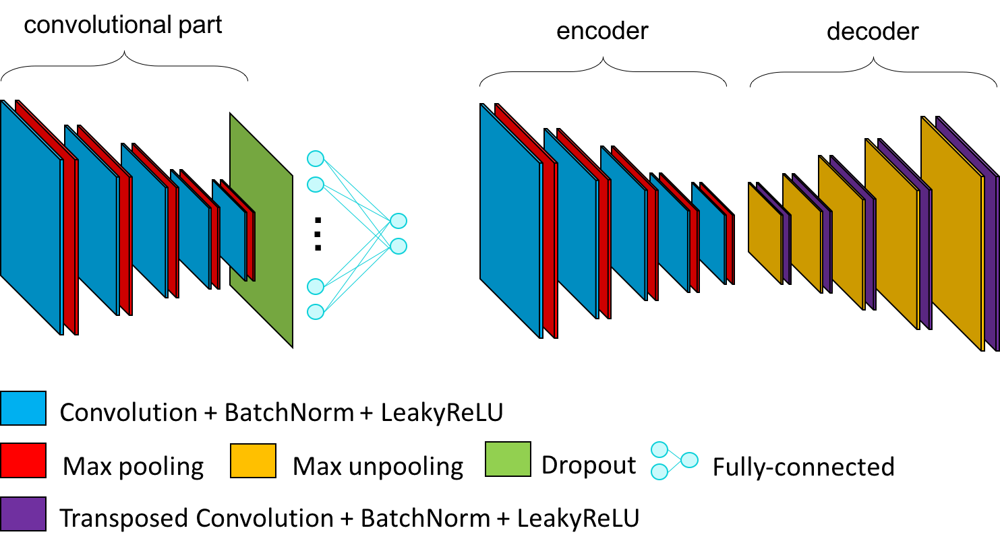
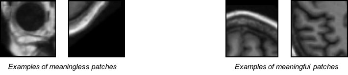

# Implementation details

Details of implementation corresponding to modules used in the provided architectures, autoencoder construction, 
transfer learning or training details are provided in this section.

## Deterministic algorithms

ClinicaDL allows to set the seed of the pseudo-random libraries used by the library (`numpy`, `random`,
and `torch`). This seed is also used in train data loaders, to avoid [the randomness 
in data loading introduced by Pytorch](https://pytorch.org/docs/stable/data.html#data-loading-randomness).

However, this is not sufficient to guarantee the exact reproducibility when using GPU (though the results will
be more close than with two different seeds). To obtain exactly the same results with the same GPU environment,
the user must specify the flag `--deterministic`. This will force CUDA to use a
deterministic behavior, but at the cost of the computation time, or the memory use.

!!! warning "Non-deterministic functions in Pytorch"
    Pytorch library is currently improving the reproducibility of their methods, 
    however all the functions do not have a reproducible equivalent yet.
    If you want to be deterministic, you may need to adapt your architecture or 
    wait until Pytorch implements the deterministic version of the function you need.

## Adaptive padding in pooling layers

Pooling layers reduce the size of their input feature maps. 
There are no learnable parameters in this layer, the kernel outputting the maximum value of the part of the feature map its kernels is covering.

Here is a 2D example of the standard layer of pytorch `nn.MaxPool2d`:


The last column may not be used depending on the size of the kernel/input and stride value. 
To avoid this, pooling layers with adaptive padding `PadMaxPool3d` were implemented in ClinicaDL to exploit information from the whole feature map.


!!! note "Adapt the padding... or the input!"
    To avoid this problem, deep learners often choose to resize their input to have sizes 
    equal to 2<sup>n</sup> with maxpooling layers of size and stride of 2.

## Autoencoders construction from CNN architectures

In ClinicaDL, autoencoders can be derived from a CNN architecture. In this case:

- the encoder corresponds to the convolutional part of the CNN,
- the decoder is composed of the transposed version of the operations used in the encoder.



The list of the transposed version of the modules can be found below:

- `Conv3d` → `ConvTranspose3d`
- `PadMaxPool3d` → `CropMaxUnpool3d` 
(specific module of `clinicadl` used to reconstruct the feature map produced by pooling layers with adaptive padding)
- `MaxPool3d` → `MaxUnpool3d`
- `Linear` → `Linear` with an inversion in `in_features` and `out_features`,
- `Flatten` → `Reshape`
- `LeakyReLU` → `LeakyReLU` with the inverse value of alpha,
- other → copy of itself

To easily transform a custom CNN architecture (without skip connections) in an autoencoder, you can use the
`CNN_Transformer` class in `clinicadl/utils/network/autoencoder/cnn_transformer.py`.

## Transfer learning

!!! warning "Model identity"
    Weights can be transferred between a source and a target network only if their layers are named
    the same way (i.e. the models are identical). To ensure transfer learning between a `CNN` and an 
    `Autoencoder`, please use the `CNN_transformer` (see section above).

It is possible to transfer trainable parameters between models. 
In the following list the weights are transferred from `source task` to `target task`:

- `AutoEncoder` to `CNN`: The trainable parameters of the convolutional part of the `CNN` 
(convolutions and batch normalization layers) take the values of the trainable parameters of the encoder part of the source autoencoder.
- `CNN` to `AutoEncoder`: The encoder takes the values of the convolutional part of the `CNN`.
- between identical networks: All the trainable parameters are transferred between the two models.
- `single` to `multi`: The single network is used to initialize each network of the multi-network framework.
- `multi` to `multi`: Each network is initialized with the weights of the corresponding one in the source experiment.

## Optimization

Since `v 1.0.4` of ClinicaDL, it is possible to chose the optimizer in `clinicadl train`. We added all the main optimizer available in [Pytorch](https://pytorch.org/docs/stable/optim.html#algorithms): 
* Adadelta,
* Adagrad,
* Adam,
* AdamW,
* Adamax,
* ASGD,
* NAdam,
* RAdam,
* RMSprop,
* SGD.

The default optimizer is [Adam](https://arxiv.org/abs/1412.6980). 

Usually, the optimizer updates the weights after one iteration, an iteration corresponding 
to the processing of one batch of images.
In ClinicaDL, it is possible to accumulate the gradients with `accumulation_steps` during `N` iterations to update
the weights of the network every `N` iterations. This allows simulating a larger batch size
even though the computational resources are not powerful enough to allow it.

<p style="text-align: center;">
<code>virtual_batch_size</code> = <code>batch_size</code> * <code>accumulation_steps</code>
</p>

## Evaluation

In some frameworks, the training loss may be approximated using the sum of the losses of the last
batches of data seen by the network. In ClinicaDL, set (train or validation) performance is always evaluated
on all the images of the set.

By default, during training the network performance on train and validation is evaluated at the end of each epoch.
It is possible to perform inner epoch evaluations by setting the value of `evaluation_steps` to the number of 
weight updates before evaluation. Inner epoch evaluations allow better evaluating the progression of the network
during training. 

!!! warning "Computation time"
    Setting `evaluation_steps` to a small value may considerably increase computation time.

## Model selection

The selection of a model is associated to a metric evaluated on the validation set.

At the end of each epoch, if the validation performance of the current state is better than the best one ever seen, 
the current state of the model is saved in the corresponding best model folder.
Such comparison and serialization is only performed at the end of an epoch, even though inner epoch evaluations 
are performed.

The command 
```
clinicadl train list_models
```
will display the list of available models that can be used.
There are a few options to get more details:

- `--architecture` (str) is the  name of the network for which information will be displayed.
- `--model_layers` (flag) to display the detailed Pytorch architecture.
- `--input_size` (str) is an option to chose a different size of the input of the model with shape C@HxW if the image is 2D or C@DxHxW if the image is 3D. 
  For example if the input size is 1@169x208x179, the option `--input_size 1@169x208x179` should be added.

## Stopping criterion

By default, early stopping is enabled to save computation time. This method automatically stops training
if during `patience` epochs, the validation loss at the end of an epoch never became smaller than the best validation
loss ever seen * (1 - `tolerance`). Early stopping can be disabled by setting `patience` to `0`.

If early stopping is disabled, or if its stopping criterion was never reached, training stops when the maximum number
of epochs `epochs` is reached.

## Image-level results

<SCRIPT SRC='https://cdn.mathjax.org/mathjax/latest/MathJax.js?config=TeX-AMS-MML_HTMLorMML'></SCRIPT>
<SCRIPT>MathJax.Hub.Config({ tex2jax: {inlineMath: [['$','$'], ['\\(','\\)']]}})</SCRIPT> 

For classification or regression tasks that take as input a part of the MRI volume (*patch, roi or slice*), 
an ensemble operation is needed to obtain the label at the image level.

For classification task, soft-voting was implemented as all inputs are not equally meaningful.
For example, patches that are in the corners of the image are mainly composed of background and skull and may be misleading,
whereas patches within the brain may be more useful.



Then the image-level probability of label 1 *p<sup>1</sup>* will be:

$$ p^{1} = {\sum_{i=0}^{35} bacc_i * p_i^{1}}$$

where:

- *p<sub>i</sub><sup>1</sup>* is the probability of label 1 for patch *i*,
- *bacc<sub>i</sub>* is the validation balanced accuracy for patch *i*.

For the regression task, hard-voting is used, then the value of the output at the image level
is simply the average of the values of all image parts.

## Multi-network

By default, all images are used as input of a unique network. With the `--multi` flag,
a network is trained per image part.

The flag `--multi` cannot be used if the number of parts per image is 1 (for example in `image` mode
or in `roi` mode if there is only one region).

## Multi-cohort

Starting from version 0.2.1, it is possible to use ClinicaDL's functions on several datasets at the same time.
In this case, the `multi-cohort` flag must be given, and the `CAPS_DIRECTORY` and the `TSV_DIRECTORY`
correspond to TSV files.

The `CAPS_DIRECTORY` argument must lead to a TSV file with two columns:

- `cohort` the name of the cohort (must correspond to the values in `TSV_DIRECTORY`),
- `path` the path to the corresponding [CAPS](https://aramislab.paris.inria.fr/clinica/docs/public/latest/CAPS/Introduction/) hierarchy.

The `TSV_DIRECTORY` argument points to a TSV file with two columns:

- `cohort` the name of the cohort (must correspond to the values in `CAPS_DIRECTORY`),
- `path` the path to the corresponding labels list, outputs of [`split`](../TSVTools.md#split---single-split-observing-similar-age-and-sex-distributions) 
or [`kfold`](../TSVTools.md#kfold---k-fold-split) methods.
- `diagnoses` the diagnoses that will be used in the cohort. Must correspond to a single string with labels separated by commas.
