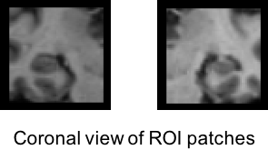

# `train roi` - Train deep learning networks using predefined Regions of Interest (ROI)

This option allows training a network on two Regions of Interest (ROI).
ROI inputs correspond to two patches of size 50x50x50 manually centered on each hippocampus.
This manual centering has only been done for `t1-linear` pipeline.



!!! warning
    Contrary to `patch` and `slice`, `roi` inputs cannot be extracted with `clinicadl extract`.

One architecture is implemented in `clinicadl` for the `roi` mode: 
`Conv4_FC3`, adapted to `t1-linear` pipeline outputs.

!!! info "Adding a custom architecture"
    It is possible to add custom architecture and train it with `clinicadl`.
    Detailed instructions can be found [here](./Custom.md).

## `train roi autoencoder` - Train autoencoders using ROI

The objective of an autoencoder is to learn to reconstruct images given in input while performing a dimension reduction. 

The difference between the input and the output image is given by the mean squared error.
In clinicadl, autoencoders are designed [based on a CNN architecture](./Introduction.md#autoencoders-construction-from-cnn-architectures). 

### Running the pipeline

Here is the command line to run the pipeline on `t1-linear` outputs with the predefined architecture of ClinicaDL: 
```
clinicadl train roi autoencoder <caps_directory> t1-linear <tsv_path> <output_directory> Conv4_FC3
```
where mandatory arguments are:

- `caps_directory` (str) is the input folder containing the neuroimaging data in a [CAPS](http://www.clinica.run/doc/CAPS/Introduction/) hierarchy.
- `tsv_path` (str) is the input folder of a TSV file tree generated by `clinicadl tsvtool {split|kfold}`.
- `output_directory` (str) is the folder where the results are stored.

!!! info "Common options"
    Options that are common to all pipelines can be found in the introduction of [`clinicadl train`](./Introduction.md#running-the-pipeline)

There is one specific option for this pipeline: 

- `--visualization` (bool) if this flag is given, inputs of the train and
the validation sets and their corresponding reconstructions are written in `autoencoder_reconstruction`.
Inputs are reconstructed based on the model that obtained the [best validation loss](./Introduction.md#model-selection).

### Outputs

The complete output file system is the following (the folder `autoencoder_reconstruction` is created only if the 
flag `--visualization` was given):

<pre>
results
├── commandline.json
├── environment.txt
└── fold-0
    ├── autoencoder_reconstruction
    │   ├── train
    │   │   ├── input-0.nii.gz
    │   │   ├── ...
    │   │   ├── input-5.nii.gz
    │   │   ├── output-0.nii.gz
    │   │   ├── ...
    │   │   └── output-5.nii.gz
    │   └── validation
    │        ├── input-0.nii.gz
    │        ├── ...
    │        ├── input-5.nii.gz
    │        ├── output-0.nii.gz
    │        ├── ...
    │        └── output-5.nii.gz
    ├── models
    │    └── best_loss
    │        └── model_best.pth.tar
    └── tensorboard_logs
         ├── train
         │    └── events.out.tfevents.XXXX
         └── validation
              └── events.out.tfevents.XXXX
</pre>

`autoencoder_reconstruction` contains the reconstructions of the two regions of the three first participants of the dataset.

## `train roi cnn` - Train classification CNN using ROI

The objective of this unique CNN is to learn to predict labels associated to images.
The set of images used corresponds to the two hippocampi in MR volumes.

The output of the CNN is a vector of size equals to the number of classes in this dataset.
This vector can be preprocessed by the [softmax function](https://pytorch.org/docs/master/generated/torch.nn.Softmax.html) 
to produce a probability for each class. During training, the CNN is optimized according to the cross-entropy loss, 
which becomes null for a subset of images if the CNN outputs 100% probability for the true class of each image of the subset.

### Running the pipeline

Here is the command line to run the pipeline on `t1-linear` outputs with the predefined architecture of ClinicaDL: 
```
clinicadl train roi cnn <caps_directory> t1-linear <tsv_path> <output_directory> Conv4_FC3
```
where mandatory arguments are:

- `caps_directory` (str) is the input folder containing the neuroimaging data in a [CAPS](http://www.clinica.run/doc/CAPS/Introduction/) hierarchy.
- `tsv_path` (str) is the input folder of a TSV file tree generated by `clinicadl tsvtool {split|kfold}`.
- `output_directory` (str) is the folder where the results are stored.

!!! info "Common options"
    Options that are common to all pipelines can be found in the introduction of [`clinicadl train`](./Introduction.md#running-the-pipeline)


The options specific to this pipeline are the following:

- `--transfer_learning_path` (str) is the path to a results folder (output of `clinicadl train`). 
The best model of this folder will be used to initialize the network as 
explained in the [implementation details](./Introduction.md#transfer-learning). 
If nothing is given the initialization will be random.
- `--transfer_learning_selection` (str) corresponds to the metric according to which the 
[best model](./Introduction.md#model-selection) of `transfer_learning_path` will be loaded. 
This argument will only be taken into account if the source network is a CNN. 
Choices are `best_loss` and `best_balanced_accuracy`. Default: `best_balanced_accuracy`.
- `--selection_threshold` (float) threshold on the balanced accuracies to compute the 
[image-level performance](./Introduction.md#soft-voting). 
Patches are selected if their balanced accuracy > threshold. Default corresponds to no selection.

### Outputs

The complete output file system is the following:

<pre>
results
├── commandline.json
├── environment.txt
└── fold-0
    ├── cnn_classification
    │   ├── best_balanced_accuracy
    │   │   ├── train_image_level_metrics.tsv
    │   │   ├── train_image_level_prediction.tsv
    │   │   ├── train_roi_level_metrics.tsv
    │   │   ├── train_roi_level_prediction.tsv
    │   │   ├── validation_image_level_metrics.tsv
    │   │   ├── validation_image_level_prediction.tsv
    │   │   ├── validation_roi_level_metrics.tsv
    │   │   └── validation_roi_level_prediction.tsv
    │   └── best_loss
    │       └── ...
    ├── models
    │   ├── best_balanced_accuracy
    │   │   └── model_best.pth.tar
    │   └── best_loss
    │       └── model_best.pth.tar
    └── tensorboard_logs
         ├── train
         │    └── events.out.tfevents.XXXX
         └── validation
              └── events.out.tfevents.XXXX
</pre>

!!! note "Level of performance"
    The performances are obtained at two different levels: region-based and image-level.
    Region-based performance corresponds to an evaluation in which both ROI are considered to be independent.
    However it is not the case, and what is more interesting is the evaluation on the image-level, 
    for which the predictions of the two regions were assembled.
